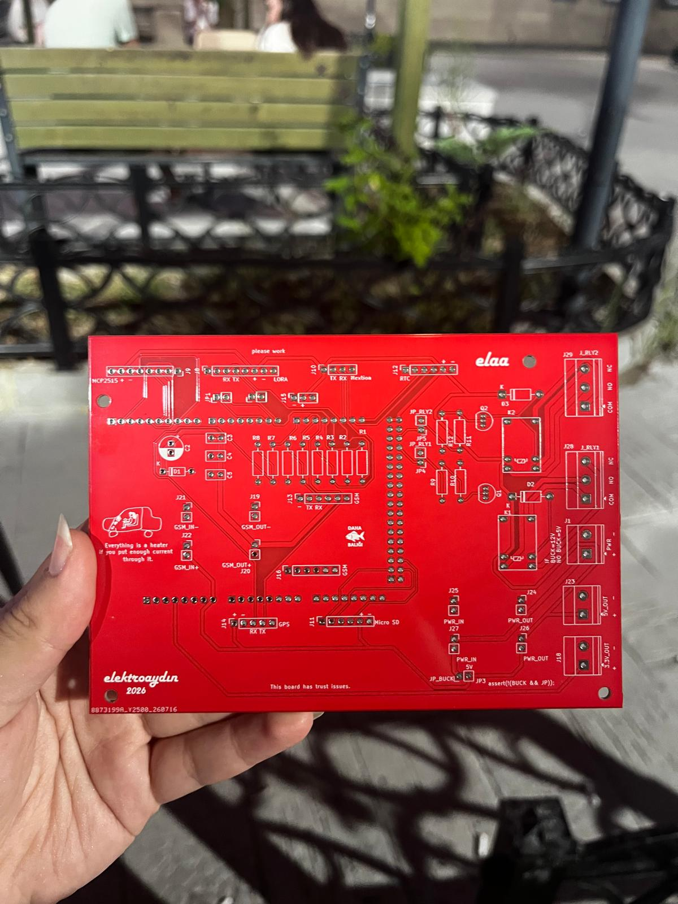
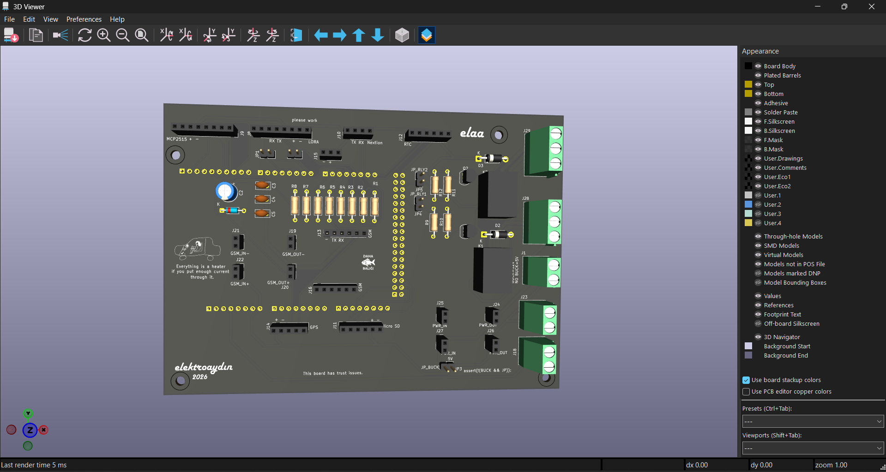
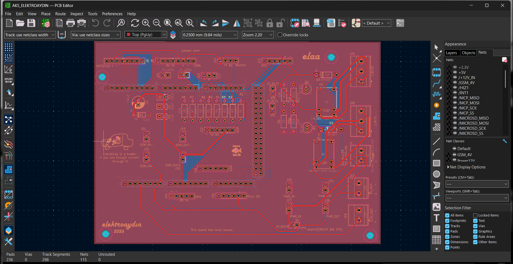
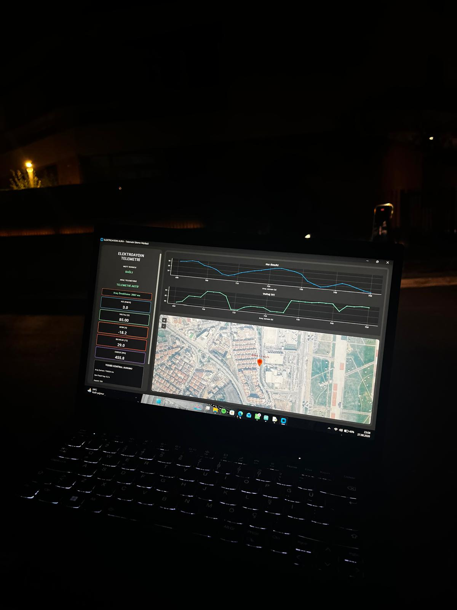

# EV Control System (AKS)

  

Custom vehicle control system PCB developed for an electric vehicle project.

## Overview

The AKS (Araç Kontrol Sistemi) is a custom vehicle control and monitoring board designed for an electric vehicle platform.

The system integrates vehicle communication, telemetry, data logging, power management and control interfaces on a single embedded hardware platform.

The project was developed as part of the ElektroAydın electric vehicle team and focuses on practical embedded hardware design, vehicle communication and system integration.

## Key Features

- ATmega2560-based control architecture
- CAN Bus communication using MCP2515
- GSM telemetry using SIM800C
- SD card data logging
- DS3231 Real-Time Clock
- Relay and contactor control
- 12 V vehicle power input
- Regulated 5 V and 3.3 V power rails
- Modular communication and peripheral interfaces

## PCB Design

### 3D View

  

### PCB Layout

  

## Communication Interfaces

| Interface | Application |
|---|---|
| CAN Bus | Vehicle and BMS communication |
| UART | GSM and external peripheral communication |
| SPI | MCP2515 CAN controller and SD card |
| I2C | DS3231 Real-Time Clock |

## Hardware Architecture

The board is designed around the ATmega2560 platform and provides multiple communication and control interfaces required for electric vehicle applications.

The hardware architecture includes:

- Vehicle CAN communication
- GSM-based telemetry
- External peripheral communication
- Data logging
- Real-time clock functionality
- Relay and contactor control
- Multi-voltage power distribution
- Modular communication interfaces

## Power Architecture

The system is powered from the vehicle's 12 V electrical system.

Voltage regulation stages are used to generate the required supply rails for the control electronics and communication modules.

The board provides:

- 12 V vehicle input
- Regulated 5 V supply
- Regulated 3.3 V supply
- Power distribution for communication modules
- Decoupling and filtering for supply stability

## CAN Bus Integration

CAN Bus communication is implemented using the MCP2515 CAN controller.

The CAN interface enables communication between the AKS and other vehicle systems such as the Battery Management System (BMS).

## GSM Telemetry

A SIM800C GSM module is used for telemetry and remote data communication.

The GSM interface enables selected vehicle data to be transmitted externally when required.

## Relay and Contactor Control

The AKS includes relay control interfaces for switching vehicle systems.

These outputs can be used to control higher-power components such as vehicle contactors through low-power control signals.

## Data Logging

Vehicle data can be stored locally using an SD card interface.

The SD card communicates with the microcontroller using SPI and can be used for:

- Vehicle data logging
- Sensor recording
- CAN data storage
- System monitoring

## Real-Time Clock

A DS3231 Real-Time Clock module is connected using I2C.

The RTC provides timestamp information for logged vehicle data and system events.

## Hardware Testing

  

The board was tested for power distribution, communication interfaces, peripheral integration and system operation.

  

## My Contribution

My responsibilities in the project included:

- System architecture design
- Schematic design
- PCB layout
- Component selection
- Power distribution design
- CAN communication hardware integration
- GSM telemetry hardware integration
- Relay and contactor interface design
- Peripheral interface planning
- PCB manufacturing preparation
- Hardware testing
- System integration

## Tools & Technologies

- KiCad
- ATmega2560
- Arduino Mega platform
- CAN Bus
- MCP2515
- SIM800C
- DS3231
- SPI
- UART
- I2C
- PCB Design
- Embedded Systems
- Hardware Testing
- Git
- GitHub

## Project Status

The project was developed as a hardware prototype for an electric vehicle control system.

The PCB was designed, manufactured and evaluated within the vehicle development process.
